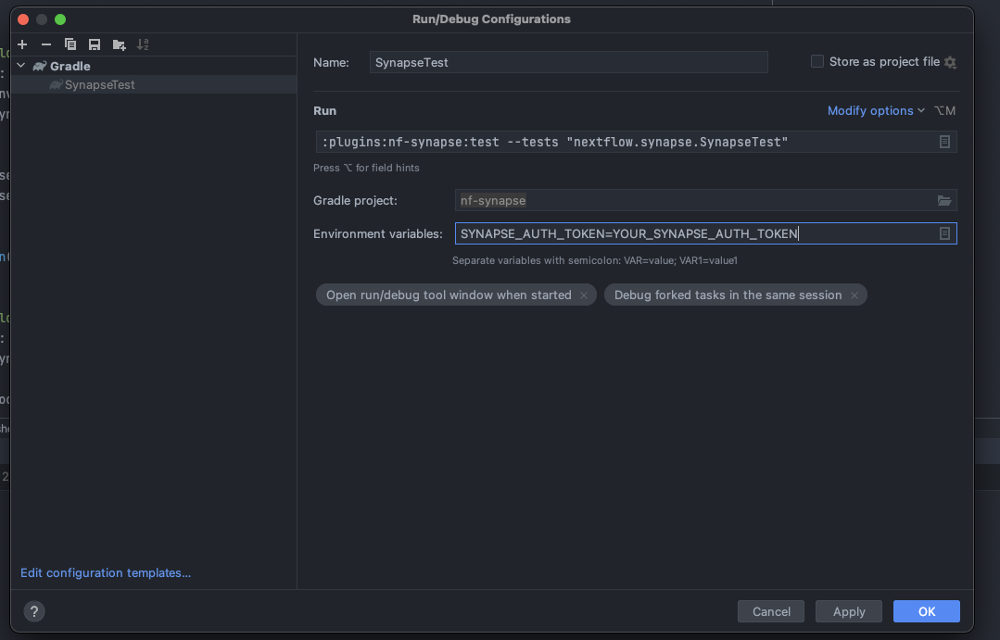

# Synapse
Synapse is a collaborative, open-source research platform that allows teams to share data, track analyses, and collaborate.
- More info: [Synapse Homepage](https://help.synapse.org/docs/)

# Nextflow
Nextflow is a reactive workflow framework and a programming Domain-specific language that eases the writing of data-intensive computational pipelines.
- More info: [Nextflow Homepage](https://www.nextflow.io/)

# Custom File System Provider
The NIO.2 API introduced in the Java SE 7 release provides the ability to develop a custom file system provider that can be used to manage file system objects. A file system is essentially a container with organized, homogenous elements referred to as file system objects. A file system provides access to file system objects. A file system object can be a file store, file, or directory. A file store is a volume or partition in which files are stored. For example, in a native file system such as on the Windows platform, commonly known drives like c: or d: are file stores. On the Solaris operating system, / (root) and mounted directories are considered file stores.
- More info: [Oracle Java Documentation](https://docs.oracle.com/javase/8/docs/technotes/guides/io/fsp/filesystemprovider.html)

# nf-Synapse plugin 
 
This project implements a Nextflow plugin named `nf-synapse` that creates the support for Synapse's Entity storage with customized Synapse File System Provider.

## Plugin assets 
                    
- `settings.gradle`
    
    Gradle project settings. 

- `plugins/nf-synapse`
    
    The plugin implementation base directory.

- `plugins/nf-synapse/build.gradle` 
    
    Plugin Gradle build file. Project dependencies should be added here.

- `plugins/nf-synapse/src/resources/META-INF/MANIFEST.MF` 
    
    Manifest file defining the plugin attributes e.g. name, version, etc.
    The attribute `Plugin-Class` declares the plugin main class. This class 
    should extend the base class `nextflow.plugin.BasePlugin` e.g. 
    `nextflow.synapse.SynapsePlugin`.

- `plugins/nf-synapse/src/resources/META-INF/extensions.idx`
    
    This file declares one or more extension classes provided by the plugin. 
    Each line should contain a Java class fully qualified name implementing 
    the interface `org.pf4j.ExtensionPoint` (or a sub-interface).

- `plugins/nf-synapse/src/main` 

    The plugin implementation sources.

- `plugins/nf-synapse/src/test` 
                             
    The plugin unit tests. 

## ExtensionPointS

ExtensionPoint is the basic interface who use nextflow-core to integrate plugins into it.
It's only a basic interface and serves as starting point for more specialized extensions. 

Among others, nextflow-core integrate following sub ExtensionPointS:

- `TraceObserverFactory` to provide a list of TraceObserverS 
- `ChannelExtensionPoint` to enrich the channel with custom methods

In this plugin you can find examples for both of them
## Run and debug plugin in the development environment

To run and test the plugin in the development environment, configure a local Nextflow build 
using the following steps:
1. Create a root folder for the whole project & cd into the folder:
    ````
    mkdir nfSynapseProject && cd nfSynapseProject
    ````
2. Clone this repo: `nf-synapse` while inside `nfSynapseProject` with:
    ````
    git clone https://github.com/Sage-Bionetworks-Workflows/nf-synapse.git
    ````
3. Clone the Nextflow while inside `nfSynapseProject` with:
    ````
    git clone https://github.com/nextflow-io/nextflow.git
    ````
4. Cd into folder `nextflow` & build the local Nextflow source code with:
    ```
    cd nextflow && ./gradlew compile exportClasspath
    ```
5. Cd into folder `nf-synapse` & compile the plugin source code:
    ```
    cd ../nf-synapse && ./gradlew compileGroovy
    ```
6. While inside `nf-synapse`, include your Synapse_Auth_Token in `nextflow.config` file:
    ```
    plugins {
        id 'nf-synapse'
    }

    synapse {
        authToken='Put_Your_Synapse_Auth_Token_Here'
    }
    ```
7. While inside `nf-synapse`, run Nextflow with `nf-synapse` plugin on the sample file `synapse_file.nf` (created in this repo) using:
    ```
    ./launch.sh run synapse_file.nf -plugins nf-synapse
    ```
## Project file structures


- `SynapsePlugin.groovy`:  Wrapper for the whole plugin project. It also establishes and installs the customized Synapse FileSystem Provider.
- `SynapsePathFactory.groovy` and `SynapsePathSerializer.groovy`: Initiation points whenever a user initiates a file using URI.
- `SynapsePath.groovy`: Implements Synapse path object.
- `SynapseConfig.groovy`: Implement system env configs for Synapse FileSystem. It includes Synapse Auth Token as one of the requirements for Synapse FileSystem env.
- `SynapseFileSystemProvider.groovy`: Implements NIO File system provider for Synapse Entity Storage. It includes most the the logic on how to create a new instance of Synapse FileSystem, inititates Synapse Java API Client (that will be used to retrieve the remote Synapse file later), enforces Synapse authentication token and Synapse entity type check.
  - Some of very important methods: newFileSystem(), getFileSystem(), getPath(), newInputStream(), delete(), copy(), move()...
- `SynapseFileSystem.groovy`: Implements NIO File system for Synapse Entity Storage.
    - Some of very important methods: SynapseFileSystem(), getPath(), newInputStream()...

## Compile & run unit tests 
Right now the user who wants to run the test cases will have to following the extra instructions inside `SynapseTest`. Particularly you will have to manually create the test mock .txt file in your Synapse repo and copy/paste the Synapse Id into `SynapseTest`. For future development, please use `Synapse Java API Client` to automate the process of create file -> upload file -> retrieve id -> delete file in Synapse repo remotely.

There are 2 ways to run the unit test cases:
1. Using the command line terminal:
   - Add variable `SYNAPSE_AUTH_TOKEN` to your system source. For MacOS, you can add the variable by:
        ```
        vim ~/.zshrc
        ```
        or
        ```
        vim ~/.bashrc
        ```
        then modify/update the source file with:
        ``` 
        export SYNAPSE_AUTH_TOKEN=YOUR_SYNAPSE_AUTH_TOKEN
        ```
        then reload the source file with:
        ```
        source ~/.zshrc
        ```
        or
        ```
        source ~/.bashrc
        ```

   - Run the following command in the project root directory (ie. where the file `settings.gradle` is located):
        ```
        ./gradlew check
        ```
2. Using IntelliJ:
   - Edit the test config:
  
   - Put your Synapse Auth Token as one of the `Environment variables`:
  
   - Then run the test suite using IntelliJ

## Logging
Currently, in various methods, `log.trace` is being used. Whenever you run a .nf files with flag `-trace`, the `.nextflow.log` files will output results from `log.trace`
```
./gradlew compileGroovy && ./launch.sh -trace nextflow.synapse run synapse_file.nf -plugins nf-synapse
```

## Package, upload and publish

The project should hosted in a GitHub repository whose name should match the name of the plugin,
that is the name of the directory in the `plugins` folder e.g. `nf-synapse` in this project.

Following these step to package, upload and publish the plugin:

1. Create a file named `gradle.properties` in the project root containing the following attributes
   (this file should not be committed in the project repository):

  * `github_organization`: the GitHub organisation the plugin project is hosted
  * `github_username` The GitHub username granting access to the plugin project.
  * `github_access_token`:  The GitHub access token required to upload and commit changes in the plugin repository.
  * `github_commit_email`:  The email address associated with your GitHub account.

2. The following command, package and upload the plugin in the GitHub project releases page:

    ```
    ./gradlew :plugins:nf-synapse:upload
    ```

3. Create a pull request against the [nextflow-io/plugins](https://github.com/nextflow-io/plugins/blob/main/plugins.json) 
  project to make the plugin public accessible to Nextflow app. 

